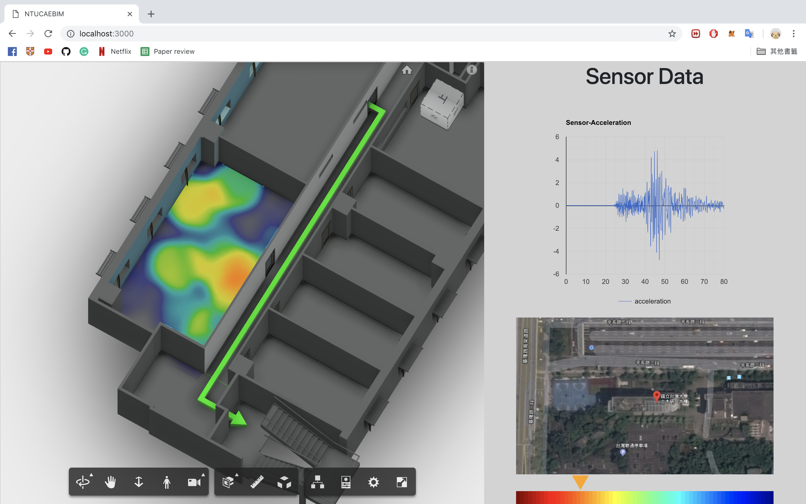

# IoT_Forge

## Description

IoTtoDB.py: The code is be used for connecting DataBase.

src : Forge file include server. client .......

## How to Run

The first step, you need to cd to ./src/ 

then...

if Mac OSX/Linux (Terminal)

    npm install
    export FORGE_CLIENT_ID=<<YOUR CLIENT ID FROM FORGE DEVELOPER PORTAL>>
    export FORGE_CLIENT_SECRET=<<YOUR FORGE CLIENT SECRET>>
    npm run dev

if Windows (use <b>Node.js command line</b> from Start menu)

    npm install
    set FORGE_CLIENT_ID=<<YOUR CLIENT ID FROM FORGE DEVELOPER PORTAL>>
    set FORGE_CLIENT_SECRET=<<YOUR FORGE CLIENT SECRET>>
    npm run dev
